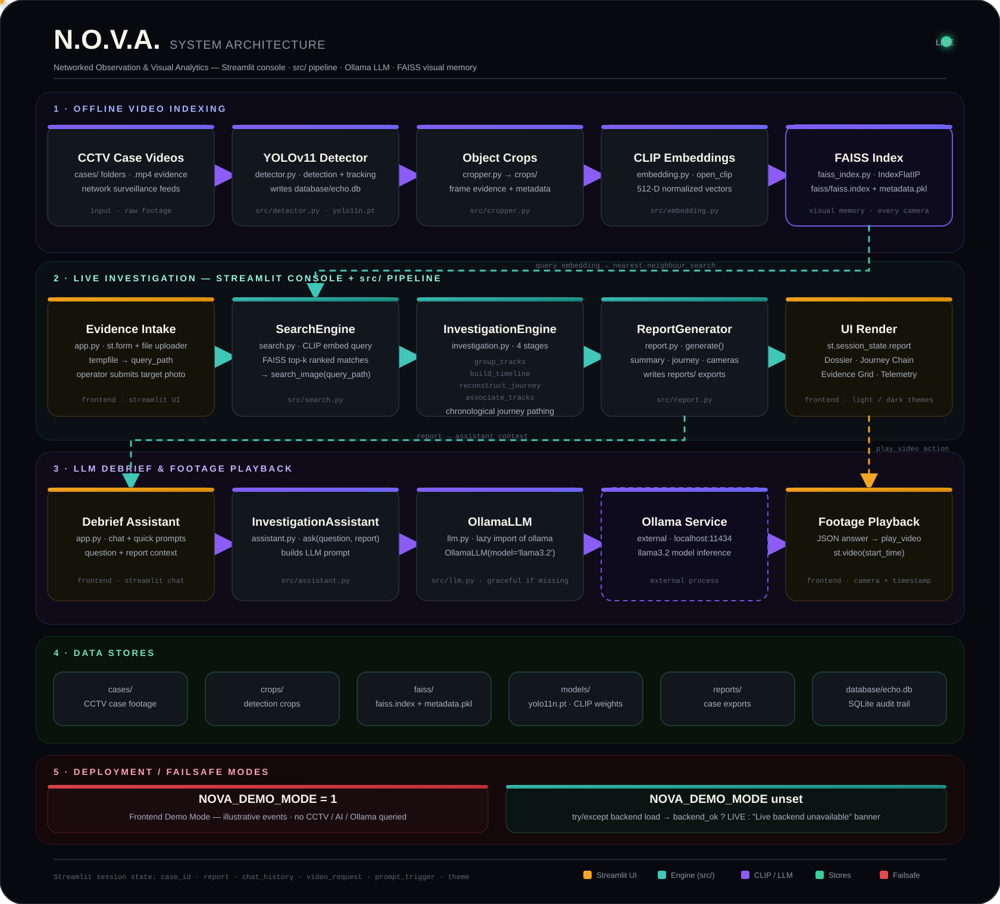
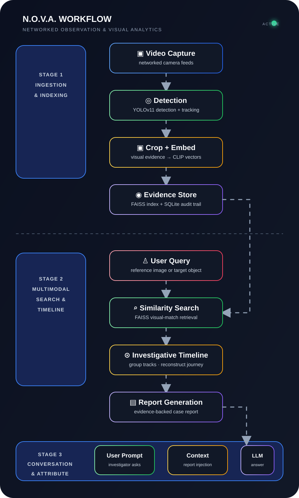

# N.O.V.A. — Networked Observation & Visual Analytics

<p align="center">
  <strong>Upload one image. Search every camera. Reconstruct the journey.</strong>
</p>

<p align="center">
  
  
  
  
  
  
  
</p>

---

## Overview

N.O.V.A. is an AI-assisted visual investigation platform that reduces hours of CCTV review to a focused set of leads. An investigator uploads a query image; N.O.V.A. searches pre-indexed surveillance footage, groups visually similar detections into tracks, reconstructs a time-ordered journey across cameras, and supports follow-up questions about the results.

The goal is to transform a large, fragmented set of camera feeds into a small set of explainable, evidence-backed visual leads.

## Key capabilities

| Capability | Implementation |
| --- | --- |
| Multi-camera indexing | Object detection and tracking over CCTV video with YOLOv11. |
| Visual similarity search | CLIP embeddings compared with FAISS cosine-similarity search. |
| Journey reconstruction | Matches grouped by camera and track, then ordered chronologically. |
| Evidence-first interface | Representative crops, timestamps, durations, track IDs, and confidence scores. |
| Conversational investigation | Local Ollama model answers questions from the generated report. |
| Auditable outputs | Detection records persisted to SQLite, CSV, crops, and a FAISS index. |

## System architecture

<p align="center">
  <a href="assets/nova-system.svg">
    
  </a>
</p>

## Workflow diagram

<p align="center">
  <a href="assets/nova-workflowdg.svg">
    
  </a>
</p>


## Quick start

### Prerequisites

- Python 3.11+
- [Ollama](https://ollama.com) (optional, required for the debrief assistant)

### 1. Clone and create an environment

```bash
git clone https://github.com/<your-username>/ECHO.git
cd ECHO

python -m venv venv
```

**Windows**

```powershell
.\venv\Scripts\Activate.ps1
```

**macOS / Linux**

```bash
source venv/bin/activate
```

### 2. Install dependencies

```bash
python -m pip install -r requirements.txt
```

### 3. Set up the local assistant (optional)

The debrief assistant runs on Ollama. Install it from [ollama.com](https://ollama.com), then pull the model:

```bash
ollama pull llama3.2
ollama serve
```

If Ollama is not available, the application still runs; the assistant returns a clear notice instead of failing.

### 4. Launch the dashboard

```bash
streamlit run app.py
```

Open the URL shown by Streamlit, upload a target photo, and select **Initiate Network Trace**.

> Note: the first launch builds the FAISS index and loads the CLIP embedding model, which can take a few minutes.

## Demo and preview mode

To preview the interface without installing the full investigation stack or Ollama, set the `NOVA_DEMO_MODE` environment variable:

**Windows (PowerShell)**

```powershell
$env:NOVA_DEMO_MODE = "1"
streamlit run app.py
```

**macOS / Linux**

```bash
NOVA_DEMO_MODE=1 streamlit run app.py
```

In demo mode, timeline events and assistant replies are clearly labelled as illustrative previews. If a live backend dependency cannot be loaded at startup, the application degrades gracefully to this preview mode rather than failing to render.

## Indexing a case

Place one or more `.mp4` videos in a case folder, then run the case processor. It detects and tracks objects, saves visual crops, writes detection records, and builds the FAISS index used by the application.

```python
from src.case_processor import CaseProcessor

CaseProcessor().process_case("cases/apartment_case_001")
```

This creates or updates:

```text
crops/              # detected object images
data/               # per-camera CSV detection exports
database/echo.db    # SQLite detection audit trail
faiss/faiss.index   # visual-search index
faiss/metadata.pkl  # metadata paired with vectors
runs/               # YOLO annotated video output
```

## Investigation workflow

1. Upload a reference image of a person or object.
2. Search the visual index for the closest matching detections.
3. Group raw frame matches into camera-specific tracks.
4. Reconstruct a chronological journey across all matching cameras.
5. Review supporting crops, times, durations, and similarity scores.
6. Ask N.O.V.A. questions such as "Where was the subject first seen?"

## Deployment notes

- Run `python -m pip install -r requirements.txt` on the target host.
- The heavy dependencies (PyTorch, FAISS, CLIP, YOLO) are required for live tracing. If any cannot be loaded, the app falls back to labeled preview mode with a warning banner.
- The assistant requires a reachable Ollama service with the configured model pulled. Without it, the assistant reports that the service is unavailable.
- Set `NOVA_DEMO_MODE=1` for a UI-only deployment that needs no model weights or databases.

## Tech stack

<p>
  
  
  
  
  
  
  
</p>

## Roadmap

- Filter search results by object class and camera
- Use track-level, cross-camera ReID instead of frame-level matches
- Add a floor-plan / camera-map journey visualization
- Add source-video jump links at each event timestamp
- Support vehicle attributes and license-plate OCR
- Add investigator feedback: same subject / not the same subject
- Add privacy controls, retention rules, and comprehensive audit logs

## Responsible use

N.O.V.A. produces investigative leads, not identity confirmation. Visual similarity can be wrong or biased, especially with poor imagery, occlusion, or changes in appearance. Every result should be reviewed by a trained human, used only with appropriate authorization, and handled according to applicable privacy and surveillance laws.

---

<p align="center">
  Built for explainable, evidence-backed visual investigations.
</p>
