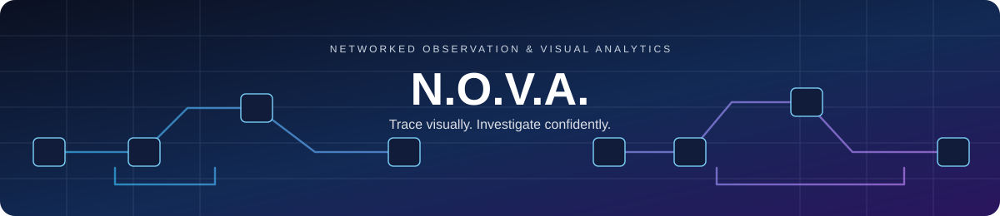

# [N.O.V.A.](https://github.com/TuhinDey18/Nova) — Networked Observation & Visual Analytics

<p align="center">
  
</p>

<p align="center">
  <strong>Upload one image. Search every camera. Reconstruct the journey.</strong>
</p>

<p align="center">
  
  
  
  
  
  
  
  
  
</p>

---

## 🏆 PIVOT POINT Hackathon — Winners

<p align="center">
  
  
</p>

<p align="center">
  <strong>N.O.V.A. won the PIVOT POINT Hackathon</strong><br />
  organised by the <strong>Computer Society of India (CSI)</strong> and <strong>IEM Kolkata</strong>.
</p>

<p align="center">
  <a href="assets/trophy.jpeg">
    
  </a><br />
  <sub>Click the trophy to view the full photo.</sub>
</p>

### Winning team certificates

<table>
  <tr>
    <td align="center"><a href="assets/cert1.jpeg"></a></td>
    <td align="center"><a href="assets/cert2.jpeg"></a></td>
    <td align="center"><a href="assets/cert3.jpeg"></a></td>
  </tr>
  <tr>
    <td align="center"><sub>TEAM MEMBER 01</sub></td>
    <td align="center"><sub>TEAM MEMBER 02</sub></td>
    <td align="center"><sub>TEAM MEMBER 03</sub></td>
  </tr>
  <tr>
    <td align="center"><a href="assets/cert4.jpeg"></a></td>
    <td align="center"><a href="assets/cert5.jpeg"></a></td>
    <td align="center"><a href="assets/cert6.jpeg"></a></td>
  </tr>
  <tr>
    <td align="center"><sub>TEAM MEMBER 04</sub></td>
    <td align="center"><sub>TEAM MEMBER 05</sub></td>
    <td align="center"><sub>TEAM MEMBER 06</sub></td>
  </tr>
</table>

<p align="center"><sub>Click any certificate to view it in full resolution.</sub></p>

---

## Overview

N.O.V.A. is an AI-assisted visual investigation platform that turns hours of CCTV review into a focused, explainable set of leads. Upload a query image and N.O.V.A. searches pre-indexed surveillance footage, groups visually similar detections into tracks, reconstructs a time-ordered journey across cameras, and supports follow-up questions about the evidence.

Its purpose is simple: transform fragmented camera feeds into concise, evidence-backed visual leads that investigators can review with confidence.

## Key Capabilities

| Capability | Implementation |
| --- | --- |
| Multi-camera indexing | YOLOv11 object detection and tracking across CCTV footage. |
| Visual similarity search | CLIP embeddings compared with FAISS cosine-similarity search. |
| Journey reconstruction | Camera and track matches grouped, then ordered chronologically. |
| Evidence-first interface | Representative crops, timestamps, durations, track IDs, and confidence scores. |
| Conversational investigation | A local Ollama model answers questions using the generated report. |
| Auditable outputs | Detection records persisted to SQLite, CSV, crops, and a FAISS index. |

## System Architecture

<p align="center">
  <a href="assets/nova-architecture.svg">
    
  </a>
</p>

## Quick Start

### Prerequisites

- Python 3.11+
- [Ollama](https://ollama.com) — optional; required only for the debrief assistant

### 1. Clone and create an environment

```bash
git clone https://github.com/TuhinDey18/Nova.git
cd Nova

python -m venv venv
```

**Windows**

```powershell
.\venv\Scripts\Activate.ps1
```

**macOS / Linux**

```bash
source venv/bin/activate
```

### 2. Install dependencies

```bash
python -m pip install -r requirements.txt
```

### 3. Set up the local assistant (optional)

The debrief assistant uses Ollama. Install it from [ollama.com](https://ollama.com), then pull and serve the model:

```bash
ollama pull llama3.2
ollama serve
```

If Ollama is unavailable, the application still runs. The assistant returns a clear notice rather than failing.

### 4. Launch the dashboard

```bash
streamlit run app.py
```

Open the URL shown by Streamlit, upload a target photo, then select **Initiate Network Trace**.

> **Note:** The first launch builds the FAISS index and loads the CLIP embedding model, which can take a few minutes.

## Demo and Preview Mode

To preview the interface without the full investigation stack or Ollama, set the `NOVA_DEMO_MODE` environment variable.

**Windows (PowerShell)**

```powershell
$env:NOVA_DEMO_MODE = "1"
streamlit run app.py
```

**macOS / Linux**

```bash
NOVA_DEMO_MODE=1 streamlit run app.py
```

In demo mode, timeline events and assistant replies are clearly labelled as illustrative previews. If a live backend dependency cannot load at startup, the application degrades gracefully to preview mode instead of failing to render.

## Indexing a Case

Place one or more `.mp4` videos in a case folder, then run the case processor. It detects and tracks objects, saves visual crops, writes detection records, and builds the FAISS index used by the application.

```python
from src.case_processor import CaseProcessor

CaseProcessor().process_case("cases/apartment_case_001")
```

This creates or updates:

```text
crops/              # detected object images
data/               # per-camera CSV detection exports
database/echo.db    # SQLite detection audit trail
faiss/faiss.index   # visual-search index
faiss/metadata.pkl  # metadata paired with vectors
runs/               # YOLO annotated video output
```

## Investigation Workflow

1. Upload a reference image of a person or object.
2. Search the visual index for the closest matching detections.
3. Group raw frame matches into camera-specific tracks.
4. Reconstruct a chronological journey across all matching cameras.
5. Review supporting crops, times, durations, and similarity scores.
6. Ask N.O.V.A. questions such as, "Where was the subject first seen?"

## Workflow Diagram

<p align="center">
  <a href="assets/nova-workflow.svg">
    
  </a>
</p>

## Deployment Notes

- Run `python -m pip install -r requirements.txt` on the target host.
- PyTorch, FAISS, CLIP, and YOLO are required for live tracing. If one cannot load, the app falls back to labelled preview mode and displays a warning banner.
- The assistant requires a reachable Ollama service with the configured model already pulled. If it is unavailable, the app reports this clearly.
- Set `NOVA_DEMO_MODE=1` for a UI-only deployment that requires no model weights or databases.

## Tech Stack

<p>
  
  
  
  
  
  
  
</p>

## Roadmap

- Filter search results by object class and camera.
- Use track-level, cross-camera ReID instead of frame-level matches.
- Add a floor-plan or camera-map journey visualization.
- Add source-video jump links at each event timestamp.
- Support vehicle attributes and license-plate OCR.
- Add investigator feedback: same subject / not the same subject.
- Add privacy controls, retention rules, and comprehensive audit logs.

## Responsible Use

N.O.V.A. produces investigative leads, not identity confirmation. Visual similarity can be wrong or biased, especially with poor imagery, occlusion, or changes in appearance. Every result must be reviewed by a trained human, used only with appropriate authorization, and handled in accordance with applicable privacy and surveillance laws.

---

<p align="center">
  Built for explainable, evidence-backed visual investigations.
</p>

## PPT

[NOVA-PPT](https://docs.google.com/presentation/d/1g84loO77ZarUxJ9k9hkVWW-PqcmG4HS-/edit?usp=drivesdk&ouid=111352118999025787129&rtpof=true&sd=true)
